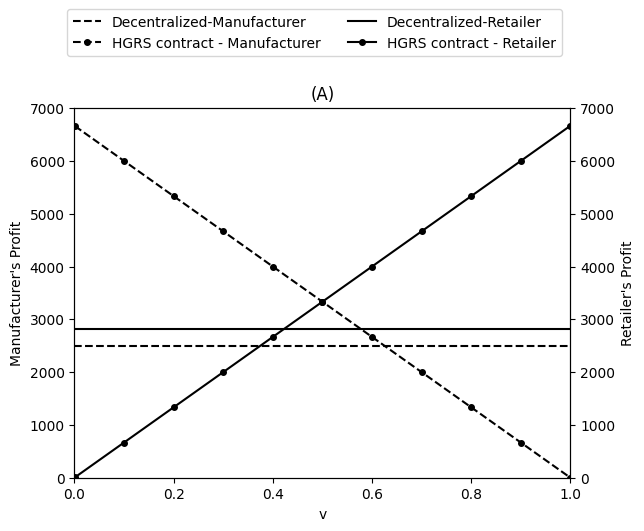
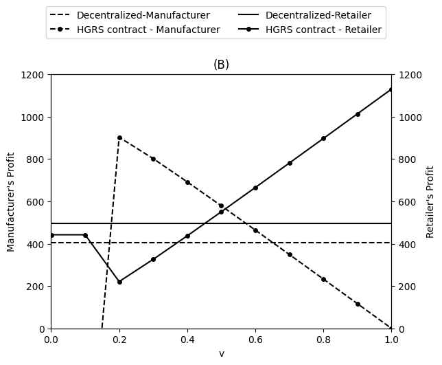
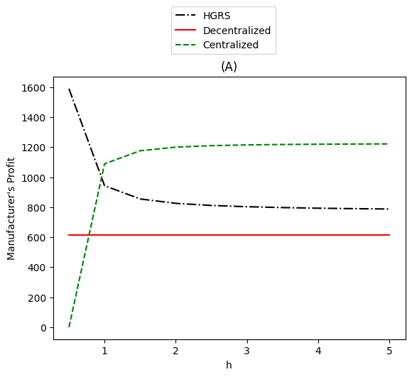
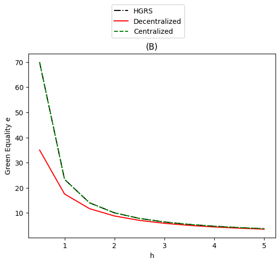
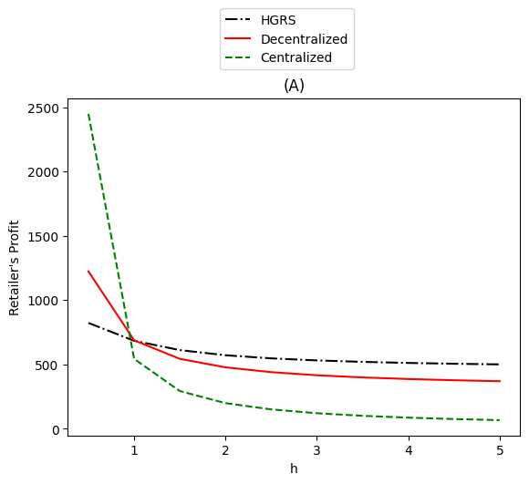
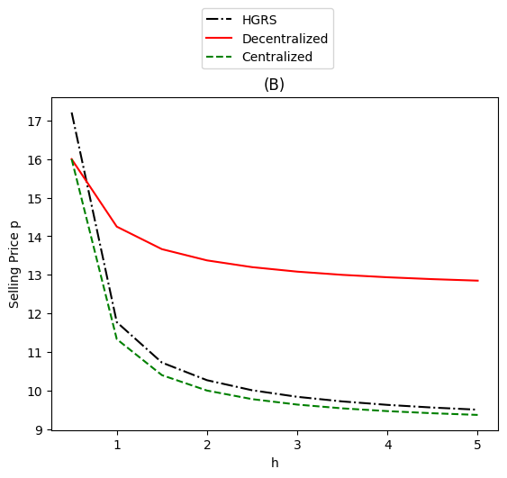

# Green Supply Chain Coordination Approach

 <!-- A green supply chain coordination approach of balancing price and green quality in presence of consumer environmental awareness. -->

<b>Table of Contents</b>

1. [Introduction](#introduction)
2. [The Model](#the-model)
   - [Model Description](#model-Description)
   - [Model Formulations and Solution](#model-formulations-and-solution)
     - [Centralised model](#1-centralised-model)
     - [Decentralised model](#2-decentralised-model)
     - [Hybrid greening cost and revenue sharing contract](#3-hybrid-greening-cost-and-revenue-sharing-contract)
3. [Numerical Analyses](#numerical-analyses)
4. [Conclusion](#conclusion)

# Introduction

This repository serves as a tutorial for implementing the Green Supply Chain Coordination Approach, inspired by the concepts outlined in the paper "Balancing price and green quality in the presence of consumer environmental awareness: a green supply chain coordination approach" authored by Jafar Heydari, Kannan Govindan & Zahra Basiri (2021). We developed this tutorial as a hands-on application for the course "Operations Research Applications and Implementation" instructed by Professor Chia-Yen Lee.

# The Model

In the proposed model, various assumptions are taken into account. Some assumptions enhance the model's realism, while others are employed for simplification. To establish a sound mathematical model, it is assumed that:

- **Single Period Setting:** The channel operates within a single period, indicating that transactions and interactions occur within a specific timeframe.
- **Environmental Awareness of Customers:** Customers in the channel possess environmental tendencies and the ability to recognise the environmental quality of the offered products.
- **Customer Sensitivity to Price:** The sensitivity of customers to price is known. Additionally, the level of Consumer Environmental Awareness (CEA) within the customer community is presumed to be measured previously through survey methods.
- **Symmetric Information Sharing:** For simplicity reasons it is considered that all the model parameters are known to both channel members, implying symmetric information sharing between them.
- **Deterministic Demand Function:** The demand function is deterministic and assumed to follow a linear relationship with the selling price and the greenness level of the product.
- **Static Pricing Scheme:** Due to the nature of the product and the business environment, a static pricing scheme is employed in the studied Supply Chain (SC). This suggests that the pricing strategy remains constant over the studied period.

## Model Description

The **notation** used in this tutorial is as follows: 
**1. Parameters**

<table>
  <tr>
    <td>Notation</td>
    <td>Description</td>
  </tr>
  <tr>
    <td><em>c</em></td>
    <td>Production cost of the manufacturer per unit</td>
  </tr>
  <tr>
    <td><em>h</td>
    <td>Greening cost coefficient</td>
  </tr>
  <tr>
    <td><em>τ</td>
    <td>Customer environmental awareness (CEA) level which is related to the willingness of consumers to buy the product with higher green quality even at a higher price</td>
  </tr>
  <tr>
    <td><em>a</td>
    <td>Basic market size</td>
  </tr>
  <tr>
    <td><em>b</td>
    <td>Price sensitivity of demand</td>
  </tr>
  <tr>
    <td><em>w</td>
    <td>The unit wholesale price</td>
  </tr>
  <tr>
    <td>&#928<em>sc</td>
    <td>Channel profit</td>
  </tr>
  <tr>
    <td>&#928<em>m</td>
    <td>Manufacturer’s profit</td>
  </tr>
  <tr>
    <td>&#928<em>r</td>
    <td>Retailer’s profit</td>
  </tr>
</table>

**2. Decision variables**

<table>
  <tr>
    <td>Notation</td>
    <td>Description</td>
  </tr>
  <tr>
    <td><em>p</em></td>
    <td>Selling price of the product (decision variable of the retailer)</td>
  </tr>
  <tr>
    <td><em>e</em></td>
    <td>The product green quality (decision variable of the manufacturer)</td>
  </tr>
</table>

**3. Coordination model variables**

<table>
  <tr>
    <td>Notation</td>
    <td>Description</td>
  </tr>
  <tr>
    <td><em>w<em>r</em></td>
    <td>Selling price of the product (decision variable of the retailer)</td>
  </tr>
  <tr>
    <td><em>&#966</em></td>
    <td>Share of greening-cost allocated to the retailer
(&#966 &#8712 [0, 1])</td>
  </tr>
  <tr>
    <td>v</td>
    <td> Share of revenue allocated to the retailer (v &#8712 [0, 1])</td>
  </tr>
</table>

## Model Formulations and solution

The optimal solutions are derived under different scenarios: (1) centralised scenario, (2) decentralised scenario, (3) coordination scenario via contracts.  

The **Demand Function** is `D = a − bp + τe`

### (1) Centralised model

$$
\begin{align}
Π_{sc}^{*} = \max_{p, e} \quad & Π_{sc} = Π_{m} + Π_{r} \\
\text{s.t.} \quad & Π_{sc} = (p - c)(a - bp + τe) - he^2 \tag{1}\\
\end{align}
$$

$$
\begin{align}
\frac{\partial Π_{sc}}{\partial p} = 0 \quad & \Rightarrow \quad p^{c*} = \frac{τ(a - bc)}{4bh - τ^2}\\
\frac{\partial Π_{sc}}{\partial e} = 0 \quad & \Rightarrow \quad e^{c*} = \frac{2ah + 2bch -cτ^2}{4bh - τ^2} \tag{2}\\
\end{align}
$$

By substituting (2) and (3) into the demand function, we obtain the demand from consumers of the centralised model:

$$
\begin{align}
D(p^{c*}, e^{c*}) = a - bp^{c*} + τe^{c*} \quad & \Rightarrow \quad D(p^{c*}, e^{c*}) = \frac{2a - 2bc}{4 - \frac{τ^2}{bh} } \tag{3}\\
\end{align}
$$

Substituting equations(2) into (1), we could obtain the optimal profit of the centralised model:

$$
\begin{align}
Π_{sc}^{c*} = \frac{a^2 - 2abc + b^2c^2}{4bh - τ^2} \tag{4}
\end{align}
$$

$$
\begin{align}
Π_{m} &= (w - c)(a - bp + τe) - he^2 \\
Π_{r} &= (p - w)(a - bp + τe) \tag{5}
\end{align}
$$

Furthermore, we seperate the overall profit into the profit of the manufacturer and retailer as (5). Again, we substitute (2) into (5) and obtain the optimal profit of the manufacturer and retailer of the centralised model:

$$
\begin{align}
Π_{m}^{c*} &= w \left(\frac{2abh - 2b^2ch}{4bh - τ^2} \right) + \frac{\begin{pmatrix} 8b^3c^2h^2 - 8ab^2ch^2 \\ - 3b^2c^2hτ^2 + 4abchτ^2 - ha^2τ^2 \end{pmatrix}}{(4bh - τ^2)^2}\\
Π_{r}^{c*} &= \frac{2bh(2a^2h - 2b^2c^2h - acτ^2 + bc^2τ^2)}{(4bh - τ^2)^2} - w\frac{2abh - 2b^2ch}{(4bh - τ^2)} \tag{6}
\end{align}
$$

### (2) Decentralised model

In a decentralised supply chain, each member aims to optimize individual profits independently. The manufacturer determines green quality, and the retailer sets prices based on profitability.
In the retailer-led Stackelberg game, the retailer decides on price first, aware of the manufacturer's decision on quality. Backward induction solves the manufacturer's problem, determining optimal quality e, then the retailer's model calculates optimal price p. To align with the retailer-led game, the manufacturer tends to set a high wholesale price. To maintain realism, we treat wholesale price as exogenous, set competitively in an environment with existing competitors.

Optimal *e* under the decentralised decision-making is

$$
\begin{align}
e^{d*}_m = \frac{(w - c)τ}{2h} \tag{7}\\
\end{align}
$$

Optimal *p* under the decentralised decision-making is

$$
\begin{align}
p^{d*}_r = \frac{a + wb + τe}{2b} = \frac{2h(a + bw) + τ^2(w -c)}{4bh} \tag{8}\\
\end{align}
$$

Substituting $e^{d*}_m$ and $p^{d*}_r$ from Equations (7) and (8) into the demand function, we can calculate market
demand under the decentralised framework as

$$
\begin{align}
D^{d*} = \frac{2h(a - wb) + τ^2(w -c)}{4h} \tag{9}\\
\end{align}
$$

Furthermore, by substitution of $e^{d*}_m$ and $p^{d*}_r$ from Equations (7) and (8) into Equation (5), we can calculate the manufacturer’s optimal profit (10) and retailer’s optimal profit (11) in the decentralised model as

$$
\begin{align}
Π^{d*}_m &= (w - c)\frac{(a - wb)}{2} \tag{10}\\
\end{align}
$$

$$
\begin{align}
Π^{d*}_r &= \frac{(2h(a - wb) + τ^2(w -c))^2}{16bh^2} \tag{11}
\end{align}
$$

The total profit of the supply chain under the decentralised scenario can be calculated as

$$
\begin{align}
Π^{d*}_{sc} &= Π^{d*}_m + Π^{d*}_r\\
&= \frac{(2h(a - wb) + τ^2(w -c))^2 \\ + 8bh^2(a -wb)(w - c)}{16bh^2}\tag{12}
\end{align}
$$

### (3) Hybrid greening cost and revenue sharing contract

Revenue sharing is a well-known strategy to coordinate the supply chain. In this section, we propose a **hybrid greening cost and revenue sharing contract (HGRS)** to coordinate the supply chain. In this contract, the manufacturer offers a new lower wholesale price and instead asks the retailerto share a portion of selling revenue. The manufacturer also asks the retailer to share a portion of greening cost.

Under this contract, the retailer agrees on collaboration if the profit under the contract is higher than the profit under the decentralised model, whereas the manufacturer agrees on collaboration if the profit under the contract is higher than the profit under the centralised model. The hybrid greening cost and revenue sharing contract is formulated as follows:

$$
\begin{align}
Π^{HGRS}_m &= ((1 - v)p + w_r - c)(a - bp + τe) - (1 - \varphi)he^2\\
Π^{HGRS}_r &= (vp - w_r)(a - bp + τe) - \varphi he^2 \tag{13}
\end{align}
$$

Note that within the new profit function of manufactureer under the contract, there comes a new wholesale price $w_r$, a portion of share from the sales income $(1 - v)$, and a portion of share from the greening cost $(1 - \varphi)$. Similarly, the new profit function of retailer under the contract includes a portion of share from the sales income $v$ and a portion of share from the greening cost $\varphi$.

The optimal green quality of product $e^{\*}$ and the optimal selling price of product $p^{\*}$ under the contract are obtained by solving the following equations:

$$
\begin{align}
e^{HGRS*}_m &= \frac{((1 - v)p + w_r + c)τ}{2h(1 - \varphi)} \\
&= \frac{τ(2bv(w_r - c) + (1 - v)(va + w_r b))}{4bhv(1 - \varphi) - τ^2 v(1 - v)} \tag{14}\\
\end{align}
$$

$$
\begin{align}
p^{HGRS*}_r &= \frac{v(a + τe) + w_rb}{2bv}\\
&= \frac{τ^2v(w_r - c) + 2h(1 - \varphi)(va + w_r b)}{4bhv(1 - \varphi) - τ^2 v(1 - v)}\tag{15}
\end{align}
$$

Putting $e^{HGRS*}_{r} = E^{C*}_m$, we obtain

$$
\begin{align}
w_r(v, \varphi) &= \frac{cv(1 + \varphi)}{1 + v} - \frac{v(4ah - cτ^2)(\varphi - v)}{(4bh - τ^2)(v + 1)} \tag{16}\\
\end{align}
$$

Similarly, putting $p^{HGRS*}_{r} = p^{c*}_r$, becomes

$$
\begin{align}
w_r(v, \varphi) &= \frac{cvτ^2 - 2ah(1 - \varphi)}{1 - \varphi} + \frac{4bh(1 - \varphi) - τ^2v(1 - v)}{b(vτ^2 + 2bh(1 -\varphi))} \cdot \left( \frac{a + bc}{2} + \frac{τ^2(a - bc)}{2(4bh) - τ^2} \right) \tag{17}\\
\end{align}
$$

To get the valid interval of the application from HGRS, we ensure the profit gained from both the manufacturer and the retailer be no less than the profit under the decentralised scenario by the following inequalities:

$$
\begin{align}
Π^{HGRS*}_m(p^{c*}_m, e^{c*}_m, w_r, \varphi, v) \geq Π^{d*}_m (p^{d*}_r, e^{d*}_m, w)\\
Π^{HGRS*}_r(p^{d*}_r, e^{c*}_m, w_r, \varphi, v) \geq Π^{d*}_r (p^{d*}_r, e^{d*}_m, w) \tag{18}\\
\end{align}
$$

By computing the inequalities (18), we obtain the valid interval of the application from HGRS in terms of $v$ from the perspective of the manufacturer as follows:

<!-- $$
\begin{align}
v \leq \frac{\left( \begin{split} (p^{c*}_r - c)(a - bp^{c*}_r + τe^{c*}_m) \\ - (w - c)(a - bp^{d*}_r + τe^{d*}_{m})\\ - h((e^{d*}_m)^{2} - (e^{d*}_m)^2) + \varphi h (e^{c*}_m)^2\\ + w_r(a - bp^{c*}_r + τe^{c*}_m) \end{split} \right)}{p^{c*}_r(a - bp^{c*}_r + τe^{c*}_m)} \tag{19}\\
\end{align}
$$ -->
$$
\begin{align}
v \leq \frac{\left( \begin{split} (p^{d*}_r - w)(a - bp^{d*}_r + τe^{d*}_m) \\ + \varphi h (e^{c*}_m)^2 + w_r(a - b^{c*}_r + τe^{c*}_m) \end{split} \right)}{p^{c*}_r(a - bp^{c*}_r + τe^{c*}_m)} \tag{20}\\
\end{align}
$$

Similarly, we obtain the valid interval of the application from HGRS in terms of $v$ from the perspective of the retailer as follows:

$$
\begin{align}
v \geq \frac{\left( \begin{split} (p^{d*}_r - w)(a - bp^{d*}_r + τe^{d*}_m) \\ + \varphi h (e^{c*}_m)^2 + w_r(a - b^{c*}_r + τe^{c*}_m) \end{split} \right)}{p^{c*}_r(a - bp^{c*}_r + τe^{c*}_m)} \tag{20}\\
\end{align}
$$

From equations (19) and (20), we can obtain the valid interval of the application from HGRS in terms of $v$, which makes the HGRS contract effective in coordinate the supply chain with a win-win outcome for both the manufacturer and the retailer.

# Numerical analyses

### 1. Parameters

In conducting the numerical analyses, we first set the parameters of the model as follows:

<table>
<tr>
<th>Examples</th>
<th>a</th>
<th>b</th>
<th>τ</th>
<th>w</th>
<th>c</th>
<th>h</th>
</tr>
<tr>
<td>Example 1</td>
<td>1000</td>
<td>50</td>
<td>10</td>
<td>10</td>
<td>0</td>
<td>2</td>
</tr>
<tr>
<td>Example 2</td>
<td>60</td>
<td>1</td>
<td>1.5</td>
<td>31.5</td>
<td>3</td>
<td>2</td>
</tr>
<tr>
<td>Example 3</td>
<td>400</td>
<td>25</td>
<td>5</td>
<td>9</td>
<td>2</td>
<td>3</td>
</table>

We calculate the decision variables under the decentralized, centralized, and hybrid greening cost and revenue sharing contract scenarios. Then we explore the accceptable interval for the parameter $v$ staisfying 
the inequalities (19) and (20) to ensure the HGRS contract is effective in coordinating the supply chain.

The following table illustrates the lower and upper bounds of the acceptable interval for the parameter $v$ in the three examples, as well as the arbitrary value eventually employed in the numerical analyses.
<table>
  <tr>
    <th>Examples</th>
    <th>vmin</th>
    <th>vmax</th>
    <th>Chosen v</th>
  </tr>
  <tr>
    <td>Example 1</td>
    <td>0.422</td>
    <td>0.624</td>
    <td>0.523</td>
  </tr>
  <tr>
    <td>Example 2</td>
    <td>0.439</td>
    <td>0.640</td>
    <td>0.540</td>
  </tr>
  <tr>
    <td>Example 3</td>
    <td>0.312</td>
    <td>0.541</td>
    <td>0.426</td>
  </tr>
</table>

Applying the chosen $v$ to the HGRS contract, we can obtain the optimal green quality of product $e^*$ and the optimal selling price of product $p^*$ under the contract. Then we can calculate the optimal profit of the manufacturer and the retailer under the contract. The following table illustrates the optimal decision variables and the optimal profit of the manufacturer and the retailer under the HGRS contract in the three examples.

<table>
<tr>
<th>Scenarios</th>
<th>Example 1</th>
<th>Example 2</th>
<th>Example 3</th>
</tr>
<tr>
<th>Decentralised</th>
</tr>
<tr>
<td>p</td>
<td>17.5</td>
<td>53.77</td>
<td>13.08</td>
</tr>
<tr>
<td>e</td>
<td>25</td>
<td>10.68</td>
<td>5.82</td>
</tr>
<tr>
<td>Πm</td>
<td>2500</td>
<td>406.1</td>
<td>612.5</td>
</tr>
<tr>
<td>Πr</td>
<td>2812.5</td>
<td>495.8</td>
<td>416.8</td>
</tr>
<tr>
<td>Πsc</td>
<td>5312.5</td>
<td>901.9</td>
<td>1029.3</td>
</tr>
<tr>
<th>Centralised</th>
</tr>
<tr>
<td>p</td>
<td>13.33</td>
<td>42.65</td>
<td>9.64</td>
</tr>
<tr>
<td>e</td>
<td>33.33</td>
<td>14.87</td>
<td>6.36</td>
</tr>
<tr>
<td>Πm</td>
<td>4444.4</td>
<td>687.9</td>
<td>1214.9</td>
</tr>
<tr>
<td>Πr</td>
<td>2222.3</td>
<td>442.2</td>
<td>121.5</td>
</tr>
<tr>
<td>Πsc</td>
<td>6666.7</td>
<td>1130.1</td>
<td>1336.4</td>
</tr>
<tr>
<th>HGRS Contract</th>
</tr>
<tr>
<td>p</td>
<td>13.33</td>
<td>42.65</td>
<td>9.64</td>
</tr>
<tr>
<td>e</td>
<td>33.33</td>
<td>14.87</td>
<td>6.36</td>
</tr>
<tr>
<td>Πm</td>
<td>3180</td>
<td>519.8</td>
<td>767.1</td>
</tr>
<tr>
<td>Πr</td>
<td>3486.7</td>
<td>610.3</td>
<td>569.3</td>
</tr>
<tr>
<td>Πsc</td>
<td>6666.7</td>
<td>1130.1</td>
<td>1336.4</td>
</tr>
</table>

Intuitively, centralized model achieves the highest profit for the whole supply chain than the other two scenarios from the above table. However, the profit obtained by the retailer worses off in centralized model in compare with the decentralized model, making it refuses to collaborate with the manufacturer. In contrast, the HGRS contract can coordinate the supply chain effectively by offering a higher profit for both the manufacturer and the retailer than the decentralized model. Therefore, the HGRS contract is effective in coordinating the supply chain with a win-win outcome for both the manufacturer and the retailer.

We further illustrate the feasible intervals for the contract parameter $v$ in the three examples with the figures below. As showed in *figure 1(A)*, the acceptable interval for the contract parameter $v$ in example 1 is $[0.422, \, 0.624]$, meaning that both the manufacturer and the retailer are able to profit more from the HGRS contract than staying indifferent, while the profit of the two conponents stays constant with the retailer earning slightly higher than the manufacturer in the decentralized scenario.

In example 2 and 3, the acceptable intervals for the contract parameter $v$ are respectively $[0.439, \, 0.640]$ and $[0.312, \, 0.541]$, as showed in *figure 1(B)* and *figure 1(C)*. Within the interval, the profits of the manufacturer and the retailer under the HGRS contract are higher than the profits under the decentralized scenario, providing a strong incentive for the two components to stay collaboration with each other.

<table>
<tr>
<td> 
image 1(A)
</td>
<td> 
image 1(B)
</td>
</tr>
<tr>
<td>
 
image 1(C)

</td>
</tr>
</table>

### 2. Sensitivity analyses

#### 2.1 Sensitivity analyses of greening cost $h$

In this section, we conduct sensitivity analyses to explore the impact of the parameters on the optimal green quality of product $e^{*}$, the optimal selling price of product $p^{*}$, as well as the profit owned by the manufacturer and the retailer under the three scenarios. Note that the behavior performed by the parameters in each example is similar, so we only illustrate the sensitivity analyses of the parameters in Example 3.

- **Manufacturer's perspective**

Owing to the higher income provided by the HGRS contract, the manufacturer prefers HGRS contract to the decentralized model. From *figure 1(A)*, we observe that the manufacturer's profitability remains constant to changes in $h$, as it selects lower values of $e$ in prevention of additional costs as illustrated by *figure 1(B)*. In contrast, the manufacturer's profitability remains higher than the decentralized model though effected by the decrease on selling price as illustrated by *figure 2(B)*.

- **Retailer's perspective**

Observing *figure 2(A)*, the retailer's profit decreases in all scenarios in react to the increase in $h$. Nevertheless, the profitability of the retailer under the HGRS contract remains higher than other two scenarios, providing a strong incentive for the retailer to stay collaboration with the manufacturer. On the other hand,  the increase of $h$ reduces the value of $p$ in all models in *figure 3(B)*. This seems to be a response from the retailer to attract customers under the decrease of $e$ by the manufacturer in *figure 1(B)*. 

In conclusion, the HGRS contract ends up with s lower selling price and a higher green quality than the decentralised model, with further potential in offering less expensive greener products to a market. 

<table>
<tr>
<td>
  
  
figure 2(A)

</td>
<td>
  
  
figure 2(B)

</td>
</tr>
<tr>
<td>
  
  
figure 3(A)

</td>
<td>
  
  
figure 3(B)

</td>
</tr>
</table>

# Conclusion

In this tutorial, we have introduced the Green Supply Chain Coordination Approach, which is a model that balances price and green quality in the presence of consumer environmental awareness. We have also provided a hands-on application of the model by implementing it in Python. The model is able to coordinate the supply chain effectively by offering a higher profit for both the manufacturer and the retailer than the decentralized model. The HGRS contract ends up with a lower selling price and a higher green quality than the decentralised model, with further potential in offering less expensive greener products to a market.

Several managerial implications for the supply chain members exists in this study; the most prominent one must be concerning the balancing the price and green quality of products. The model not only guarentees more profit for both members but also stimulate demand by offering cheaper and greener products over economics of scale.

Regarding potential future research studies, a consideration of problem of asymmetric information sharing would be a good start, where the manufacturer doesn't share the greening costs to the retailer. Also, competition between multiple manufacturers and retailers could be considered in the model, where the manufacturer and retailer are able to choose their partners. Finally, the model could be extended to a multi-period setting, where the manufacturer and retailer are able to make decisions over multiple periods.